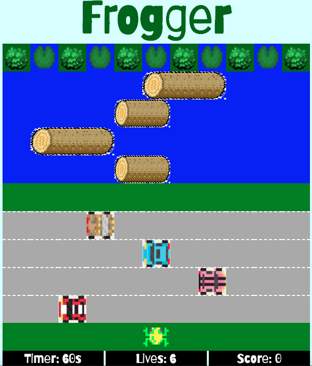
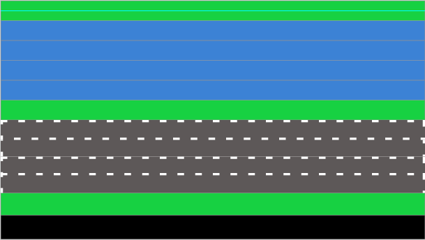

## FROGGER

### Instructions & Rules

instructions: 
1. use the arrow keys to move your frog up, down, and side to side, 
2. the goal is to get across the roadway and river to the safety of the lilypads
3. each lilypad can only be visited ONCE
4. you must cross before time runs out
5. **CARS** and **LOGS**(frogs can SWIM!) are **dangerous** - LOOK OUT!!! 
6. click "play" to set the board when you're ready to begin
7. the timer will start when you move your frog)

### Play Here
[Click to Play Frogger](https://erinjohnson47.github.io/frogger/)

### Technologies Used
- JavaScript
- HTML5
- CSS3

### Wireframe
#### Planning the board:

#### Planning the board array and strings:

#### Working through moving the frog:

### Bugs and In Progress Items
- There are some issues with the cars and logs images moving more slowly on the screen than in the code, so the frog can sometimes overlap with an image, but it does not register as a collision, on that same note, the image appends after the car div has already moved, meaning that when the frog still appears to be one space away, it sometimes registers as a collision.
    - _this can possible be partially alleviated by removing the for loops in the car intervals so there is less lag time between establishing current position and appending the image_
- There are some issues with the cars slicing "c" from the array
- The logs all go in the same direction
    - _this is a simple fix, but a bit time consuming due to the length of the log codes and I didn't want to mess with it now and risk breaking the log functionality before presentation_
- The board does not clear at Game Over, to restart, you need to refresh the page
- There are some issues with slicing the 'F' from the car arrays where it occassionally 
- I would like to look into creating Classes for the cars and logs to see if some of the information can be re-used for each car instances rather than being so repetitive

### Features to Explore
- add additional scoring: 5 points for forward move, 2 or 3 points for left/right move, bonus points for finishing round within certain amount of time
- Update the modal to pop up after each round informing player of bonus points, time it took to complete round, etc.
- blood splat or some other indicator when frog dies
- The logs should be safe to jump ON, not avoid, but I did not get a chance to develop this functionality - it is something I hope to continue to work on further
- The logs and cars only have 1 item per row at a time - in the real game, there are several cars/logs in each row making

