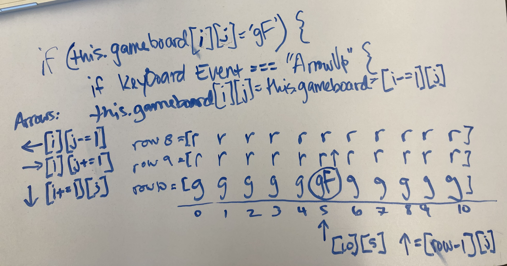

## FROGGER

### Instructions & Rules

instructions: 
1. use the arrow keys to move your frog up, down, and side to side, 
2. the goal is to get across the roadway and river to the safety of the lilypads
3. each lilypad can only be visited ONCE
4. you must cross before time runs out
5. **CARS** and **LOGS**(frogs can SWIM!) are **dangerous** - LOOK OUT!!! 
6. click "play" to set the board when you're ready to begin
7. the timer will start when you move your frog)

### Play Here
[Click to Play Frogger](https://erinjohnson47.github.io/frogger/)

### Technologies Used
- JavaScript
- HTML5
- CSS3

### Wireframe
#### Planning the board:

#### Planning the board array and strings:

#### Working through moving the frog:

